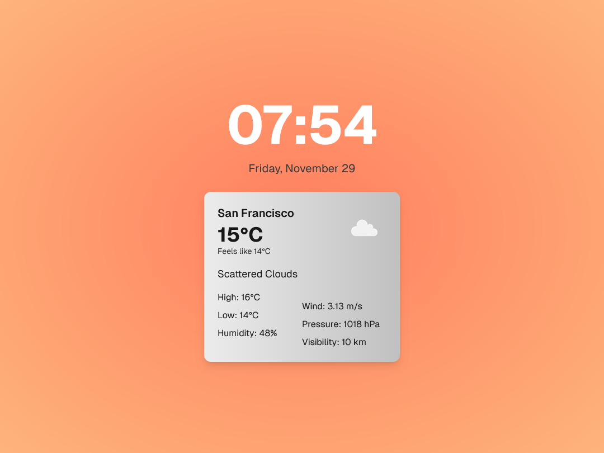
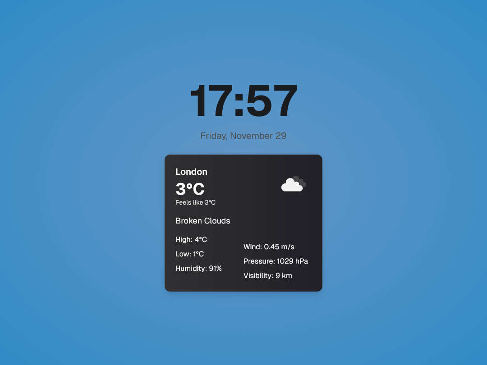
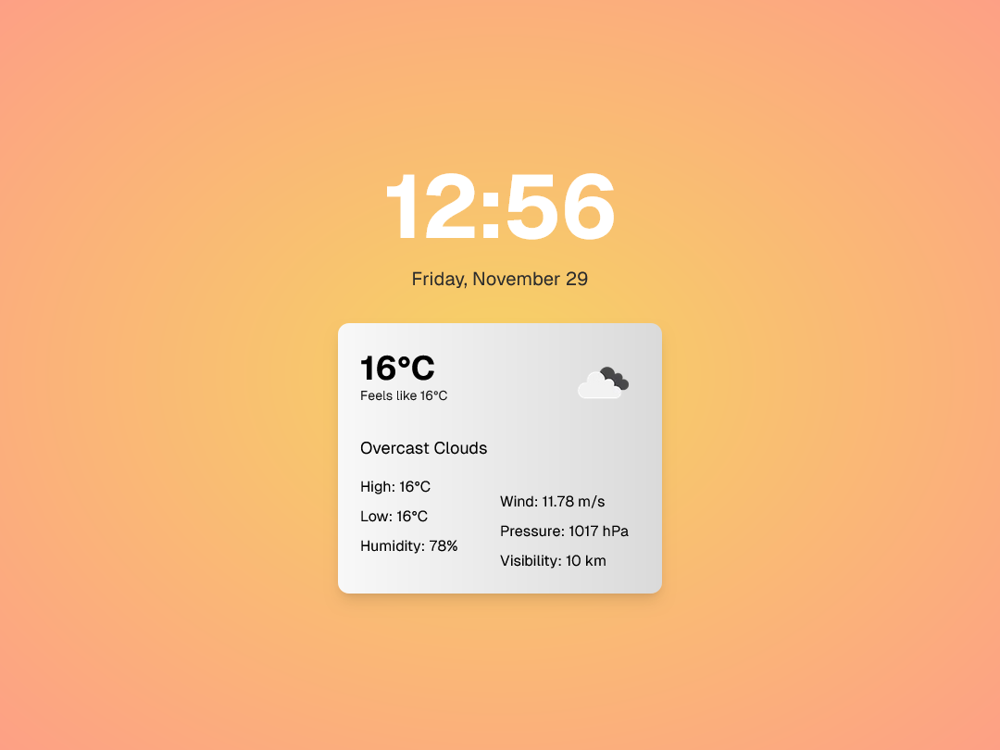
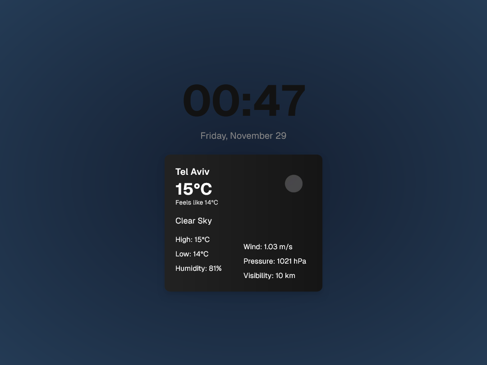

# Clock & Weather Webapp

A minimalist webapp displaying time and weather information with theme changes based on the time of day. Perfect for use as a screensaver or ambient display.

View it live at: [clock.yoav.xyz](https://clock.yoav.xyz/)

## Features

- Real-time clock display
- Current weather information with location detection
- Dynamic themes that change throughout the day

## Screenshots






## Technology Stack

- Next.js
- TypeScript
- Tailwind CSS
- OpenWeatherMap API

## Development

1. Clone the repository
2. Install dependencies:
``` npm install ```
3. Create a .env file with your OpenWeatherMap API key:
```
NEXT_PUBLIC_WEATHER_API_KEY=
NEXT_PUBLIC_DEFAULT_LATITUDE=
NEXT_PUBLIC_DEFAULT_LONGITUDE=
```
4. Run the development server:
``` npm run dev ```

## Attribution

 - Favicon: [Iconic Panda](https://www.flaticon.com/authors/iconic-panda)
 - Fonts: Geist Sans & Geist Mono

